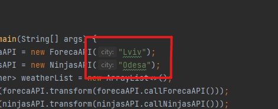

## Simple Weather App
___
Use `git clone` to clone the [app](https://github.com/kolesnykv/Weather.git)
* Enter the city name to get weather forecast:

 

* to extend potential of the app, you can connect endless amount of different apis, some examples 
are collected [here](src/main/resources/possibleApis.txt) 